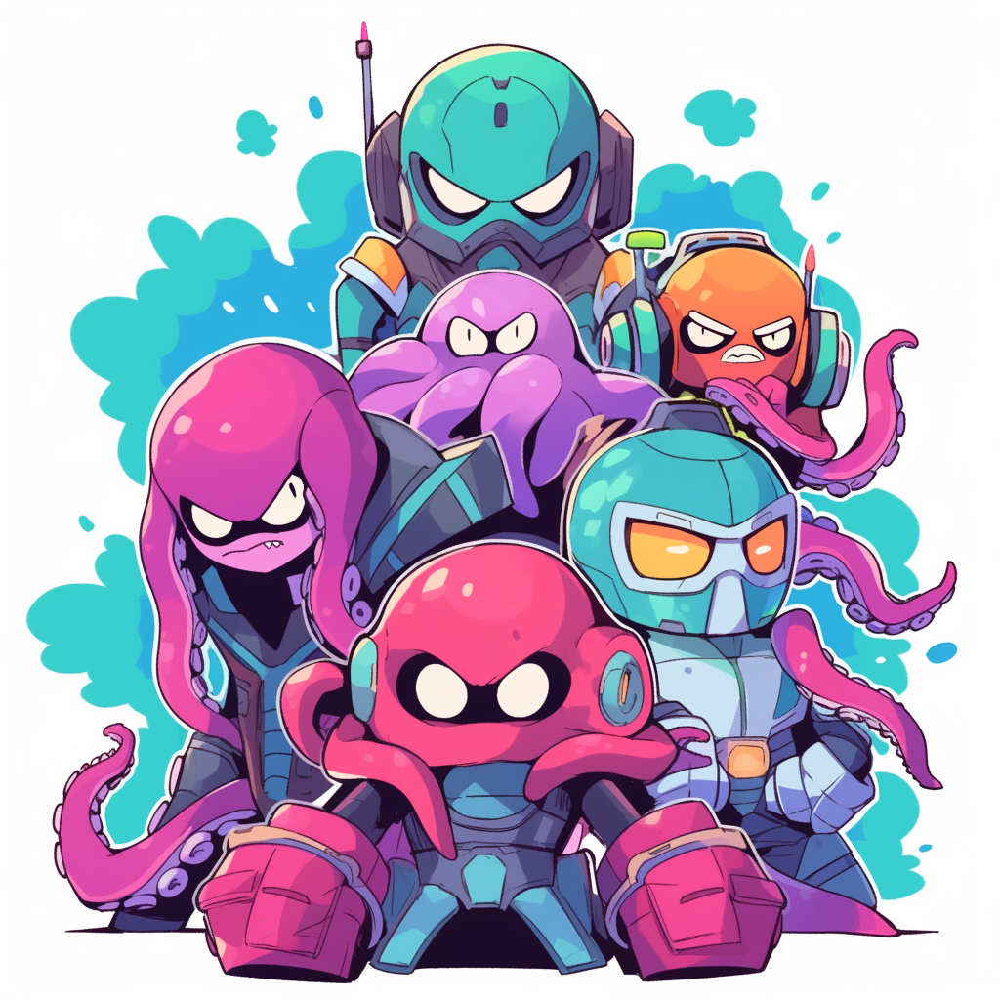

# SquidSquad
From all corners of the maybe-seven procedurally-generated seas, arise, O Mighty SQUAD Of SQUID, and hark unto me!



# What?
SquidSquad is the successor to [SquidLib](https://github.com/yellowstonegames/SquidLib), and can be considered an
overhaul but not a total rewrite. Like SquidLib, it provides tools for all sorts of procedural generation, and is
particularly focused on the needs of roguelike games. It is a group of loosely-linked modules, where you only need to
depend on the modules you need. All the modules depend on `squidcore`, which always depends on
[jdkgdxds](https://github.com/tommyettinger/jdkgdxds) for data structures, the
[checker-qual](https://github.com/typetools/checker-framework) annotations library,
[digital](https://github.com/tommyettinger/digital) for various number and digit stuff,
[juniper](https://github.com/tommyettinger/juniper) for random number generation, and
[regexodus](https://github.com/tommyettinger/RegExodus) for cross-platform regular expressions with an expanded API. This is already quite a few dependencies,
but checker-qual is rarely needed by user code, and the rest mostly have roles that were moved out of squidlib-util in
earlier versions.

The important `squidgrid` module has an extra dependency on [crux](https://github.com/tommyettinger/crux), which
mostly provides interfaces that other libraries can use without needing `squidgrid` (instead needing `crux`). Some
modules (`squidglyph`, `squidsmooth`, `squidpress`, and all the `squidstore` modules) depend on
[libGDX](https://libgdx.com/), which is recommended for use with SquidSquad but not always required. That means if you
don't use `squidglyph`, `squidsmooth`, `squidpress`, or `squidstore`, you can use SquidSquad in purely-server-side code,
in tests, or otherwise outside the application lifecycle libGDX expects. The `squidfreeze` modules all depend on
[Kryo](https://github.com/EsotericSoftware/kryo) and [kryo-more](https://github.com/tommyettinger/kryo-more).

The various dependencies are updated independently of SquidSquad. Some are going to be very familiar if you used
SquidLib before. `digital` is essentially an expansion on the NumberUtils, ArrayTools, and CrossHash classes from
squidlib-util, with some extra features. `jdkgdxds` acts like some of the frequently-used data structures in SquidLib,
such as `OrderedSet` and `IntIntOrderedMap`; these have direct parallels in `jdkgdxds`, but there's also `IntIntMap`,
`LongIntMap`, `LongIntOrderedMap`, `LongFloatOrderedMap`, and so on. Most of these implement the few interfaces they
can, but anything with primitive keys or values doesn't have many options for existing interfaces. `juniper` acts like
a substitute for `RNG` and related classes in squidlib-util; it doesn't have all the same random number generators, but
you can get most of the important/widely-used ones in `squidold`, which should be fairly backwards-compatible. You might
not want to, though; the generators in juniper tend to have passed really large amounts of testing (tens of terabytes of
a suite of tests, and sometimes over 10 petabytes of a single test), and are often extremely fast. Plus, they have more
features out-of-the-box, like easy serialization of potentially much-larger states to Strings; squidlib-util could only
handle 64-bit states for that. `regexodus` is also a dependency of `squidlib-util`; it hasn't changed. It provides
cross-platform regular expressions that work the same on GWT as on desktop, and adds a few features.

# Which?
There are currently quite a few modules here; they depend on each other when necessary, so pulling in one module as a
dependency will usually pull in a few others. The full list is:
 - squidcore
   - Needed by all other modules, this provides core functionality used everywhere else, like utilities for handling
     Strings, conversions between numbers and text, dice and probability tables, and compression for Strings and byte
     arrays. It also importantly contains the code to describe colors, even if it can't display them.
     - Much of the functionality that was in squidcore has been moved to the external `digital` library. 
 - squidgrid
   - Needed by many of the other modules, this provides tools for handling 2D positions on grids, such as the vital
     `Coord` and `Region` classes, but also `FOV` (Field of Vision), `BresenhamLine` and `OrthoLine` (for line of
     sight), `Radiance` and `LightingManager` (for light sources), and `LineTools` (for getting box drawing characters
     to represent walls, which can be useful in graphical games as well as text-based ones). These are all grouped into
     one place in `VisionFramework`, which does a lot of the work that would otherwise be repeated in different
     codebases. `squidgrid` also provides the `Noise` class, which is a large and highly-configurable way of producing
     continuous noise, such as Perlin noise, plus many single-purpose noise classes that implement `INoise`. On top of
     this, there are `Coord`-based collections, such as `CoordObjectMap`, based on the `jdkgdxds` collections but
     specialized for Coord keys.
     - This module depends on [crux](https://github.com/tommyettinger/crux), allowing other libraries to share the same
       point interfaces.
 - squidtext
   - This only uses `squidcore`, and has various tools for procedurally-generating text. This text could be readable, as
    `Thesaurus` produces, or could be complete gibberish, as `Language` produces. `Translator` offers a middle ground,
     for text that seems to be unintelligible but can be translated in bits and pieces back to English. `Messaging`
     allows conjugating present-tense text to use singular and/or plural pronouns, and is as correct as its input is at
     the conjugation quality. `MarkovText` allows mixing text from a large original source to make gibberish that sounds
     somewhat like the original.
 - squidsmooth
   - This depends on `squidcore` and `squidgrid`. It provides smooth interpolation for various kinds of `Glider`s, all
     managed by a `Director` that can be paused, resumed, stopped, and restarted. Example `Glider`s are `VectorGlider`,
     which smoothly changes two float components (x and y), `IntColorGlider`, which interpolates between two different
     colors as time goes on, and `AngleGlider`, which is usually used to make rotations turn taking the shorter
     distance. You can chain multiple gliders in a sequence with `SequenceGlider`, and can make multiple Gliders run at
     the same time by merging them.
   - `squidsmooth` can be useful for graphical games, but is less useful for text-based ones.
 - squidglyph
   - This depends on `squidcore` and `squidgrid`. It provides text-based display (meant for classical
     roguelikes and games like them) using the external library `TextraTypist`. Right now it only provides `GlyphGrid`,
     which makes it somewhat easier to handle a grid of text with smoothly-moving glyphs over it, `GlyphActor`, which
     is a scene2d `Actor` drawn with just one (potentially colorful or styled) glyph, and some classes for `Action`s,
     which can be applied to a `GlyphGrid` or `GlyphActor`.
   - On platforms other than GWT, this module can load [REXPaint](https://www.gridsagegames.com/rexpaint/) .xp files. It
     can also save a `GlyphGrid` to a new .xp file. These use the small `XPIO` class.
 - squidpath
   - Pathfinding, mostly using a modified older version of [simple-graphs](https://github.com/earlygrey/simple-graphs). There
     is also `DijkstraMap` here, which is good for some types of pathfinding that simple-graphs' `A*` algorithm can't
     do as easily. If you're using `A*`, you might want to consider [gand](https://github.com/tommyettinger/gand),
     which is based on the current simple-graphs release instead of an older one, has most relevant classes marked
     as `Json.Serializable` using libGDX `Json`, and also has path smoothing compatible with `squidgrid`'s `Coord`
     class. Gand also has a backport of `DijkstraMap`, called `GradientGrid`. This depends on `squidgrid`.
 - squidplace
   - Dungeon generation, mostly, with some code for other type of person-scale map generation as well. Most of the maps
     are produced as `char[][]` grids, and `DungeonTools` provides various utilities for handling such grids. The large
     `DungeonProcessor` class can be used to ensure only the connected areas of a map are preserved, and can place
     doors, water, grass, boulders, and so on, using an environment 2D array to know what can be placed where. This
     depends on `squidgrid`.
 - squidpress
   - Input handling, wrapping libGDX input classes to match the features SquidLib offers already. This depends on
     libGDX. This supports key rebinding in `SquidInput`, and there's an existing vi-keys rebind in `keymaps/`.
 - squidworld
   - World map generation; this can be rather complex, but see the demos and tests in this project for ideas on how to
     use it. This depends on `squidcore`, `squidgrid`, and `squidplace`.
 - squidold
   - Compatibility with older versions of SquidLib (and potentially SquidSquad). This tries to exactly replicate the
     results of some core classes from older SquidLib, such as random number generators and `CrossHash`, but support the
     newer APIs here. This depends on `squidcore`.
- squidstore
    - Split up into a few submodules: `squidstorecore`, `squidstoregrid`, `squidstoreold`, and `squidstoretext`, with
      each one containing the necessary registration code to save and load their corresponding module to JSON. This uses
      libGDX Json and its custom serializers.
 - squidfreeze
    - Like `squidstore`, but using [Kryo](https://github.com/EsotericSoftware/kryo) instead of libGDX Json. Kryo uses
      a binary format, rather than somewhat-human-readable JSON code, and can produce much smaller serialized data in
      most cases, while both serializing and deserializing more quickly than any JSON library I've tried.
    - Unlike most other modules here, `squidfreeze` is not GWT-compatible, because Kryo isn't either.
 - squidwrath
    - Like `squidstore` or `squidfreeze`, but using [Apache Fury](https://fury.apache.org) instead of libGDX Json. Fury
      uses a binary format, like Kryo but incompatible, and can produce generally smaller serialized data in
      most cases, while both serializing and deserializing even more quickly than Kryo.
    - Unlike `squidfreeze`, many classes can be serialized by `squidwrath` without needing a special serializer
      (the class still needs to be registered with Fury, just not with `registerSerializer()`). If a serializer isn't
      present in `squidwrath`, that usually means you don't need a serializer when registering it.
      - All random number generators in `juniper` and any classes in `squidcore` or `squidpath` that can be serialized
        don't need any serializer to be registered. That means `squidwrathcore` and `squidwrathpath` are empty other
        than their tests.
    - Unlike most other modules here, `squidwrath` is not GWT-compatible, because Fury isn't either.

# Why?
Various issues cropped up repeatedly over the five-year development of SquidLib 3.0.0, such as the desire by users to be
able to only use part of the library instead of needing the monolithic squidlib-util JAR. Other issues were more
problematic during development, like how squidlib-util defined its own (elaborate) data structures based on
heavily-altered code from an older version of [fastutil](https://github.com/vigna/fastutil), and needed a lot of effort
to add new types of those data structures. All of SquidLib depended and still (sort-of) depends on Java 7; now with
virtually all targets permitting at least some of Java 8 or even Java 11, there's not much reason to reach back 12 years
to July 2011, when Java 7 came out.

# How?

You'll probably want to see [the one standalone demo here](https://github.com/yellowstonegames/SquidLib-Demos/tree/master/SquidSquad/DawnSquad);
it's in SquidLib-Demos and uses the wonderful DawnLike tileset by DragonDePlatino and DawnBringer. This demo is also
present as a test in `squidsmooth`, but the standalone version of it shows how you can use SquidSquad in a complete
libGDX application.

If you use ProGuard on desktop or iOS platforms, you need to add a line to your `proguard.pro` file. This allows
`squidcore` and, if needed, `squidgrid` to function after ProGuard does its optimizations:

```
-optimizations !code/simplification/string
```

Note that this line will be added automatically to the Android R8 configuration,
which is subtly different from ProGuard configuration on any other platform.
If you only use ProGuard on Android (where it's really using R8), you shouldn't need
to change any `.pro` files manually to use SquidSquad. You may still need to make
changes to those files to keep things like scene2d.ui from libGDX.

# Get?

The dependency situation is complicated because everything depends on `squidcore`, and that depends on several other
libraries. It's easier on projects that don't target GWT; for non-web projects like that, you can probably just depend
on the SquidSquad module(s) you want, and the rest will be obtained by Gradle. Depending on this with Gradle can use a
released version such as the current `4.0.0-beta1`, which can be obtained from the main source for dependencies on the
JVM, Maven Central. You can also get a specific commit, typically a newer one, using JitPack. The Maven Central
dependencies [can be seen for each version here](https://search.maven.org/search?q=g:com.squidpony), and look like
`implementation 'com.squidpony:squidcore:4.0.0-beta1'`.

As an alternative, [the JitPack page is here](https://jitpack.io/#yellowstonegames/squidsquad); go to the Commits tab, choose any commit
except for `-SNAPSHOT`, click "Get It", and wait to see if it built successfully. Maybe get yourself some of your
beverage of choice during this time. If it built successfully, "Get It" will be green; if it failed, it will have
changed to "Report" in red. You probably don't have to report a build failure; these often are caused by the build
timing out, rather than any glitch on JitPack's side. If you refresh the page (you might have to click "Get It" again,
though this time it won't take any time at all) and scroll down, all the dependencies will be in a drop-down for you
to select as you see fit. The first Gradle code section isn't needed here; even year-old gdx-setup and gdx-liftoff
projects can download from JitPack like they can from anywhere else, without extra configuration. Dependencies using
JitPack look like `implementation 'com.github.yellowstonegames.squidsquad:squidcore:0123456789'`, where `0123456789`
is a commit version (usually 10 hex digits). Older versions use PascalCase for the names of modules, such as `SquidCore`
instead of `squidcore`.

For GWT... OK. Deep breaths. Please use [gdx-liftoff](https://github.com/tommyettinger/gdx-liftoff). Do not use
gdx-setup. Use Maven only if you are an absolute wizard. Select SquidSquad dependencies here, and gdx-liftoff will take
care of their dependencies on and off GWT. Generate the project. Relax. If you need to add another dependency, from
SquidSquad or somewhere else, my usual recommendation is to generate an empty project with all dependencies you want
selected, then to compare the `gradle.properties` and all `build.gradle` files between your empty and original projects.
Copy over any changes you want, reload your Gradle project, and you're done. There probably won't be many changes, and
they will probably all be in the dependencies, but this ensures all the versions are up-to-date and necessary other
projects are present.

Liftoff fetches SquidSquad from Maven Central, and need a fixed release for `squidSquadVersion`. Right now, the best
such release is `4.0.0-beta1`. You can always use a more recent build of SquidSquad, using JitPack to build a recent
commit. You should typically use a recent commit from [its JitPack page](https://jitpack.io/#yellowstonegames/squidsquad) for your `squidSquadVersion` property.
The group is different for JitPack builds of SquidSquad; change `com.squidpony` to
`com.github.yellowstonegames.squidsquad` when using JitPack. Note that the artifact IDs may have changed if you are
updating from before `4.0.0-beta1` to that release or later; now they are all lower-case to match conventions, so
`SquidGrid` is now `squidgrid`. It's referred to as `squidgrid` in other places, so this simplifies things.

JitPack is generally recommended over the Maven Central alpha or beta releases, because you can (and really
should) specify an exact commit to use on the Commits tab (click "Get It" on any commit except -SNAPSHOT; this will
provide useful info below once it... eventually... builds). I strongly discourage using JitPack's -SNAPSHOT versions,
because they can change without warning and don't tell you what commit you are actually using; use a commit instead!

The other versions go up fairly often as things are fixed or improved, but they will be at least:

  - `digitalVersion`=0.4.8
  - `jdkgdxdsVersion`=1.6.0
  - `juniperVersion`=0.6.1
  - `regExodusVersion`=0.1.15
  - `cruxVersion`=0.0.1
  - `textraTypistVersion`=0.10.0

# License

[The Apache License 2.0](LICENSE).

# Thanks!

Most of the code here was by Tommy Ettinger, but not all of it! Various places copy (also Apache-licensed) code from
libGDX, and sometimes other Apache-licensed libraries. Some places use MIT-licensed code, and I've tried to keep the MIT
license header close to where the MIT-licensed code is. The `A*` pathfinding code uses code from 
[simple-graphs](https://github.com/earlygrey/simple-graphs), mostly because I haven't found any better `A*` code for
what we use it for. Some of the world map code uses an MIT-licensed `ProjectionTools` class made by Justin Kunimune.
There are probably other examples throughout here... Where public domain code was copied into here, I really have no
obligation to even credit the original author, but I try to anyway.

The SquidSquad.png image was AI-generated by [Daniele Conti](https://github.com/fourlastor). Thanks!

The various fonts in `assets/` all have their license next to the font files. The Dawnlike files, in `assets/dawnlike`,
require attribution to DawnBringer and DragonDePlatino.

The credits for `assets/Game-Icons.png` are more complex; since the file is from TextraTypist, you should consult
[its list of contributors](https://github.com/tommyettinger/textratypist/blob/10f9ce48315e34289054bf03d50453c7650775d7/README.md#thanks)
and include the whole list (since the PNG includes the work of all those contributors) if you use Game-Icons. In
general, consulting TextraTypist's credits guide is a good idea if you use the assets here. Because we do use 
`Game-Icons.png` here, in some fashion, here are the credits for all the contributors to that image:

- Lorc, http://lorcblog.blogspot.com
- Delapouite, https://delapouite.com
- John Colburn, http://ninmunanmu.com
- Felbrigg, http://blackdogofdoom.blogspot.co.uk
- John Redman, http://www.uniquedicetowers.com
- Carl Olsen, https://twitter.com/unstoppableCarl
- Sbed, http://opengameart.org/content/95-game-icons
- PriorBlue
- Willdabeast, http://wjbstories.blogspot.com
- Viscious Speed, http://viscious-speed.deviantart.com
- Lord Berandas, http://berandas.deviantart.com
- Irongamer, http://ecesisllc.wix.com/home
- HeavenlyDog, http://www.gnomosygoblins.blogspot.com
- Lucas
- Faithtoken, http://fungustoken.deviantart.com
- Skoll
- Andy Meneely, http://www.se.rit.edu/~andy/
- Cathelineau
- Kier Heyl
- Aussiesim
- Sparker, http://citizenparker.com
- Zeromancer
- Rihlsul
- Quoting
- Guard13007, https://guard13007.com
- DarkZaitzev, http://darkzaitzev.deviantart.com
- SpencerDub
- GeneralAce135
- Zajkonur
- Catsu
- Starseeker
- Pepijn Poolman
- Pierre Leducq
- Caro Asercion

(Projects that use `Game-Icons.png` can copy the above list of contributors to comply with its license.)

